包含 AI 辅助创作。

## 国际化语言设计

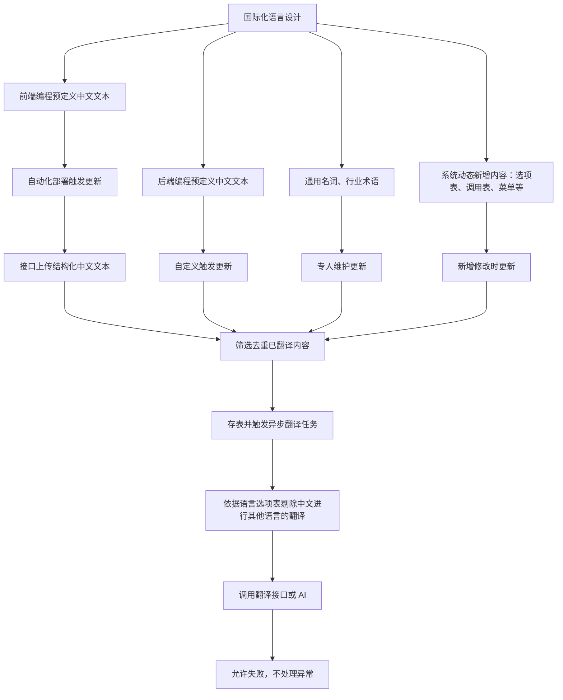

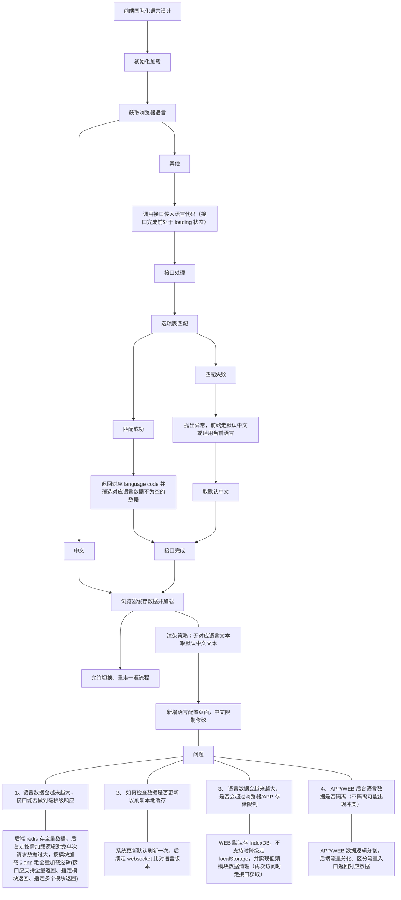

> 为了保证 SEO、与 WEB 网络兼容，应服务端应支持降级兼容 `Accept-Language` 

---

你当前的国际化设计已覆盖核心流程，但可从自动化提效、配置化管理和性能优化三个维度升级，减少80%的人工干预。以下是基于行业最佳实践的优化方案：

### 一、开发流程自动化：从手动维护到无感集成

**1. 代码层自动提取与翻译**  

使用 I18n Fast 或 Kiwi 等工具链，通过 VS Code 插件在开发阶段自动扫描中文文本，生成语义化 key 并同步至翻译系统。例如选中代码中的 "用户登录"，插件可自动生成 `user.login.title` 键并调用百度翻译 API 生成英文文案，全程无需开发者手动修改语言文件。  

> 配置复杂，生成语义化 Key 需要对接 AI，PASS

**2. 构建流程无缝嵌入**  

在 Webpack/Vite 配置中集成自动化插件，如 `vite-auto-i18n-plugin`，实现：  

- 开发时：检测文件变动自动更新翻译  
- 构建时：批量处理新增文案并去重  
- 部署时：按语言拆分资源包实现 CDN 按需加载  

> 需要对接翻译接口，翻译文案不能满足本土化需求，无法动态配置、增加删减语言，PASS

**3. 翻译协作标准化**  

采用 "开发-翻译-校验" 闭环流程：

1. 开发者提交代码触发钩子，提取新增文案至在线表格（如飞书多维表格）  
2. 翻译团队在线编辑后，Webhook 自动同步至项目语言文件  
3. CI 流程校验翻译完整性，缺失时自动阻断合并  

### 二、配置化体系：从硬编码到动态调控

**1. 语言策略集中管理**  

建立统一的语言配置服务，支持：  

- **动态语言包**：通过管理后台配置新增语言（如阿拉伯语），无需代码部署  
- **优先级规则**：用户设置 > Cookie > 请求头 > 默认语言，兼容前后端场景  
- **灰度发布**：对特定用户群启用测试语言版本  

**2. 多维度资源控制**  

在配置中心设置细粒度规则：  

| 配置项            | 示例值               | 作用                     |
| ----------------- | -------------------- | ------------------------ |
| `maxCacheSize`    | `5MB`                | 限制浏览器缓存上限       |
| `updateThreshold` | `30%`                | 差异率超阈值触发全量更新 |
| `fallbackPolicy`  | `zh-CN→en-US→base64` | 多级降级策略             |

**3. 前端渲染策略配置**  

通过 JSON 配置文件定义渲染规则：  

```json
{
  "render": {
    "missingText": "显示默认中文",
    "loadingState": "骨架屏占位",
    "direction": { "ar-SA": "rtl", "default": "ltr" } // 适配阿拉伯语右对齐
  }
}
```

### 三、性能与稳定性优化：从能用 to 好用

**1. 资源加载策略升级**  

- **分片加载**：按路由拆分语言包（如 `home.en.json`、`profile.en.json`），首屏仅加载核心模块  
- **预加载机制**：根据用户行为预测可能切换的语言（如检测到美国 IP 预加载英语包）  
- **增量更新**：通过 ETag 比对仅拉取变动的翻译条目，减少 70% 网络传输量  

**2. 缓存机制双保险**  

- **三级缓存**：内存缓存（当前会话）→ IndexedDB（持久化）→ CDN（兜底）  
- **主动失效**：配置中心推送版本号，客户端检测到不一致时触发更新  

**3. 异常处理增强**  

- **翻译失败降级**：调用 AI 翻译接口超时后，自动切换至备用接口（如百度→有道）  
- **数据校验**：使用 JSON Schema 验证翻译文件格式，异常时回滚至上次可用版本  

### 四、落地实施路线图

1. **基础改造（1-2周）**  

   - 集成 i18n Ally 插件实现开发提效  
   - 按业务模块拆分现有语言文件  

2. **自动化建设（2-3周）**  

   - 开发翻译同步 Webhook  
   - 配置构建流程自动化插件  

3. **性能优化（2周）**  

   - 实现分片加载与增量更新  
   - 部署缓存策略与监控告警  

### 五、关键问题解决方案

| 原问题         | 优化方案                                                |
| -------------- | ------------------------------------------------------- |
| 语言包体积膨胀 | 路由级分片+按需加载，配合 Tree-Shaking 移除未使用词条   |
| 缓存更新不及时 | 版本号比对 + WebSocket 推送更新通知                     |
| 存储超限风险   | LRU 淘汰策略+IndexedDB 容量监控，超限自动清理低频语言包 |
| 前后端数据冲突 | 统一语言服务API，前端通过`Accept-Language`传递上下文    |

这种架构已在微策略、字节跳动等企业验证，可使新增语言的配置时间从 3 天缩短至 2 小时，翻译更新周期从周级降至分钟级。核心是将国际化从 "开发任务" 转变为 "配置项"，让开发者专注业务逻辑而非翻译维护。

## 主题设计

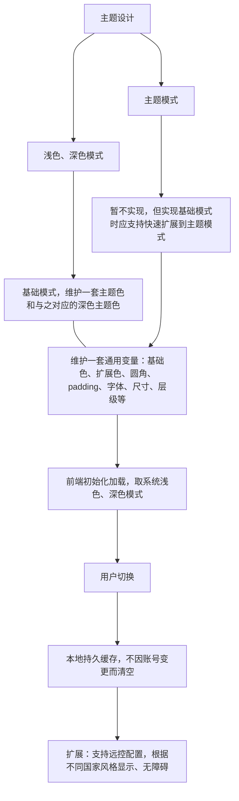

## 配置化设计

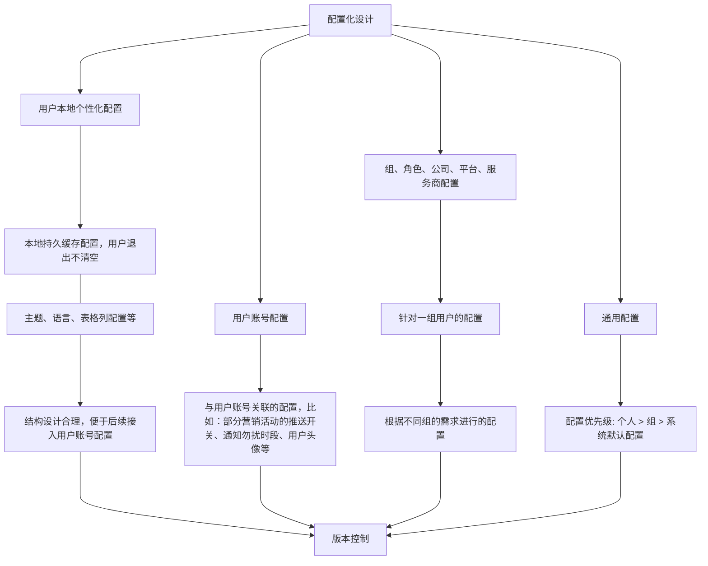

> 那么后端如何根据这种配置设计进行后端代码的自适应呢？比如设置了某个组使用美西时区进行时间字段的格式化，或配置某些角色拥有查看用户完整电话的权限（与权限等其他设计关联）？或某个用户配置了当前时间的 晚上 9 点到早上 8 点不希望推送通知；如何在代码层面做好这些功能，而不必书写命令式的编程

要实现后端代码的 “配置自适应”，核心思想是将 **“硬编码逻辑” 转变为 “数据驱动逻辑”**。

你提到的时区转换、字段脱敏、通知拦截，分别对应了后端处理链路中的三个关键环节：**序列化层、AOP/中间件层、业务逻辑层**。

以下是实现这些自适应功能的后端代码方案：

1. 时区自适应：上下文感知转换（序列化层）

   不要在业务代码里手动转换时区。利用 Web 框架的拦截器，将配置的时区注入到当前请求的 `ThreadLocal`（上下文）中。

   - **实现方案：**

     1. **拦截器提取：** 在请求入口处（Interceptor/Filter），根据配置引擎获取该组/用户的时区（如 `America/Los_Angeles`）。
     2. **上下文存储：** 存入 `UserContext`。
     3. **JSON 序列化器适配：** 自定义 Jackson/Fastjson 序列化器，在返回 Date 字段时动态读取上下文时区。

     ```java
     // 1. 定义上下文
     public class UserContext {
         private static final ThreadLocal<ZoneId> ZONE_ID = new ThreadLocal<>();
         public static void setZone(ZoneId zone) { ZONE_ID.set(zone); }
         public static ZoneId getZone() { return ZONE_ID.get() != null ? ZONE_ID.get() : ZoneOffset.UTC; }
     }
     
     // 2. 自定义日期序列化器
     public class ConfigurableDateSerializer extends JsonSerializer<LocalDateTime> {
         @Override
         public void serialize(LocalDateTime value, JsonGenerator gen, SerializerProvider serializers) {
             // 自动根据配置转换时区
             ZonedDateTime zonedDateTime = value.atZone(ZoneOffset.UTC).withZoneSameInstant(UserContext.getZone());
             gen.writeString(zonedDateTime.format(DateTimeFormatter.ISO_OFFSET_DATE_TIME));
         }
     }
     ```

2. 字段权限自适应：声明式脱敏（注解驱动）

   对于“查看完整电话”的需求，这属于 **配置化脱敏**。将配置设计映射到权限框架（如 Shiro/Spring Security）中。

   - **实现方案：**
     使用自定义注解配合 AOP（切面）或 返回值拦截。

     ```java
     public class UserVO {
         private String name;
     
         @SensitiveMask(type = MaskType.PHONE, permissionConfig = "view_full_phone")
         private String phoneNumber;
     }
     
     // AOP 处理逻辑
     @Around("execution(* *(..)) && @annotation(SensitiveMask)")
     public Object maskData(ProceedingJoinPoint joinPoint) {
         Object result = joinPoint.proceed();
         // 1. 获取当前用户聚合配置中的 'view_full_phone' 开关
         boolean canSee = ConfigEngine.getBoolean("view_full_phone");
         
         // 2. 如果配置为 false，则执行正则脱敏 (138****0000)
         if (!canSee) {
             return maskHelper.apply(result);
         }
         return result;
     }
     ```

3. 通知拦截自适应：策略模式 + 过滤器链（逻辑层）

   对于 “晚上 9 点到早上 8 点不推送” 这种基于逻辑判断的配置，建议采用 **“策略插件”** 模式。

   - **实现方案：**
     定义一个通知过滤器接口，业务代码只管发送通知，由过滤器决定是否 “丢弃” 或 “延迟”。

     ```java
     public interface NotificationFilter {
         boolean shouldSend(User user, Notification content);
     }
     
     // 时间窗口策略实现
     public class TimeWindowFilter implements NotificationFilter {
         @Override
         public boolean shouldSend(User user, Notification content) {
             // 从聚合配置获取用户设置：{ "quiet_start": "21:00", "quiet_end": "08:00" }
             Config config = ConfigEngine.getUserConfig(user.getId());
             LocalTime now = LocalTime.now(config.getZoneId());
             
             if (isInQuietPeriod(now, config)) {
                 return false; // 拦截发送
             }
             return true;
         }
     }
     
     // 业务调用层 (非常简洁)
     public void sendNotice(String userId) {
         Notification notice = new Notification("活动提醒");
         // 自动遍历所有配置策略，只有全部通过才发送
         if (notificationService.evaluate(userId, notice)) {
             pusher.send(notice);
         }
     }
     ```

4. 核心：自适应代码架构的三个原则

   1. **配置注入（Contextualization）：**
      通过拦截器将当前请求涉及到的所有层级配置（用户、组、平台）聚合后，放入 **Request Context**。后续所有代码只需从 Context 取值，不要再去查数据库。
   2. **非侵入性（Non-Invasive）：**
      尽量使用 **注解（Annotation）**、**过滤器（Filter）** 或 **中间件**。业务逻辑代码应该写成：`saveOrder(order)`，而不是 `if (config == 'A') { saveA } else { saveB }`。
   3. **默认行为（Fallthrough）：**
      在代码层面，必须为每种配置项定义 **Default Value**。当后端配置系统宕机或数据丢失时，系统应能回退到最保守的默认行为（如：默认脱敏、默认使用系统时区）。

### 总结

要实现后端 “自适应”，你需要在 **数据的出口（序列化）**、**访问的关卡（AOP）**和 **逻辑的入口（过滤器）** 设置配置挂钩点。这样，业务逻辑保持纯净，所有的差异化表现都由 “配置感知组件” 自动完成。

## 权限设计

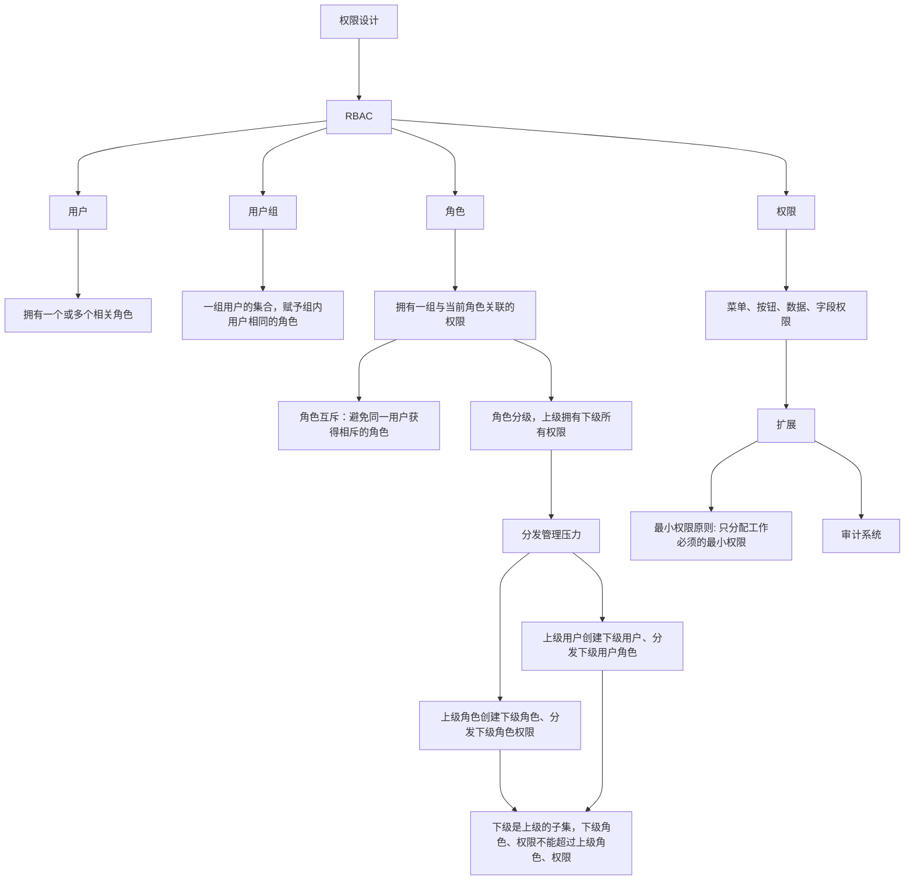

---

要在代码中稳健地适配权限体系，避免因漏洞导致权限异常，关键在于将安全思维渗透到从前端到后端，再到数据层的每一个环节，并遵循严格的安全编码规范。下面我将从 **权限校验的完整链条** 和 **安全编码的核心原则** 两个方面，为您提供一个详实的方案。

###  🔒 构建全方位的权限校验链条

一个健壮的权限体系需要在三个层面进行校验，形成纵深防御。

| 层级            | 核心任务                                                     | 关键实现点与常见方案                                         |
| :-------------- | :----------------------------------------------------------- | :----------------------------------------------------------- |
| **前端界面层**  | **提升用户体验**，根据权限动态展示或隐藏界面元素（菜单、按钮、页面），实现 “可见即可操作”。 | • **统一权限钩子/函数**：封装权限判断逻辑，如定义一个 `usePermission(code)` 的钩子，在组件中调用 `const canEdit = usePermission('user:edit')`，再通过 `v-if` 或条件渲染控制元素。<br/>• **路由守卫**：在进入页面前校验用户是否有该页面权限，无权限则重定向到 403 页面。**注意：前端校验仅为友好性设计，不可依赖为安全屏障。** |
| **后端 API 层** | **核心安全防线**，对每一个 API 请求都必须进行严格的权限校验。 | • **注解/装饰器（推荐）**：在 API 入口方法上添加如 `@PreAuthorize("hasPermission('order', 'delete')")` 的注解，利用 AOP 在方法执行前自动拦截校验。<br/>• **中间件/拦截器**：定义全局权限拦截器，对请求路径进行匹配和鉴权。<br/>• **服务内校验**：在业务方法内部显式调用权限服务进行校验。**此层校验必须执行，防止恶意绕过前端直接调用 API。** |
| **数据访问层**  | **实现数据权限**，控制用户能访问哪些数据记录（行级）或字段（列级）。 | • **SQL 自动注入**：在 ORM 框架或 SQL 生成阶段，自动拼接数据过滤条件（如 `WHERE department_id = ?`）。这是最高效的方式，避免先查出所有数据再在内存中过滤。<br/>• **字段权限控制**：在返回数据前，根据规则对实体的特定字段进行脱敏或过滤。 |

### ️ 遵循安全编码核心原则

在编写权限相关代码时，请时刻牢记以下几项基本原则。

1. **最小权限原则 (Principle of Least Privilege)**

   这是权限设计的黄金法则。应确保应用程序的运行账户、数据库连接账户以及分配给用户的权限，都是其完成操作所必需的 **最小权限集合**。例如，一个用于查询的报告服务，绝不应被授予`DELETE` 或 `ALTER` 等高危权限。

2. **输入验证与输出编码**

   - **永不信任用户输入**：所有来自客户端的参数，如用户 ID、资源 ID，都必须经过严格验证。检查其类型、格式、长度和范围，防止 SQL 注入或越权攻击。**优先使用白名单验证**，只允许已知安全的输入。

   - **安全地处理输出**：将数据输出到前端时，要根据上下文（HTML, SQL, JavaScript）进行编码，防止 XSS 攻击。例如，将 `<` 编码为 `&lt;`。

3. **默认拒绝与错误处理**

   - 权限检查逻辑应采用 **默认拒绝** 策略。即，当权限规则无法明确允许时，应直接拒绝请求。

   - **错误处理要谨慎**：向用户返回通用的错误信息（如 “操作失败”），而 **不要泄露详细的系统错误堆栈、SQL语句或文件路径**，以免为攻击者提供线索。

4. **管理依赖与安全更新**

   及时更新项目中用于权限管理或安全相关的第三方库（如 Spring Security、Shiro，或专门的授权服务如 Permify），以避免使用含有已知漏洞的旧版本。

###  ⚠️ 重点规避的常见陷阱

- **越权漏洞**：这是最危险的漏洞之一，包括 **水平越权**（能操作不属于自己的数据，如用户 A 能修改用户 B 的数据）和 **垂直越权**（低权限用户能执行高权限操作）。防范的关键在于，API 中不仅要校验用户是否有操作权限，还必须校验当前操作的数据 ID 是否属于该用户授权的数据范围。

- **前端权限幻觉**：绝不能仅依赖前端隐藏按钮来控制权限。恶意用户完全可以跳过页面直接调用API，因此 **后端必须对每个请求进行二次校验**。

- **性能瓶颈**：权限校验是高频操作，要避免每次请求都执行复杂的数据库关联查询。解决方案是将用户的权限列表缓存在 Redis 等高性能缓存中，权限变更时刷新缓存即可。

###  💎 总结与检查清单

为了帮助您在开发过程中自查，可以对照以下清单：

| 阶段         | 检查项                                                       |
| :----------- | :----------------------------------------------------------- |
| **设计阶段** | □ 是否遵循了最小权限原则？<br/>□ 是否明确了数据权限的规则（如基于部门、基于用户）？ |
| **编码阶段** | □ **每个 API** 是否都进行了权限校验？<br/>□ 操作数据时，是否校验了用户与数据项的归属关系？<br/>□ 是否对所有用户输入进行了验证？<br/>□ 错误信息是否避免了敏感信息泄露？ |
| **测试阶段** | □ 是否进行了越权测试（尝试用不同账号操作他人数据）？<br/>□ 是否测试了无权限、部分权限、全部权限等各种场景？ |

最后，权限安全是一个持续的过程。建议引入 **安全代码扫描工具**（SAST）进行静态检查，并建立完善的 **操作审计日志**，记录所有关键的权限变更和敏感操作，以便事后追溯和分析。

希望这份详细的指南能帮助您在代码中构建一个坚固的权限防护体系。

## 文件服务设计

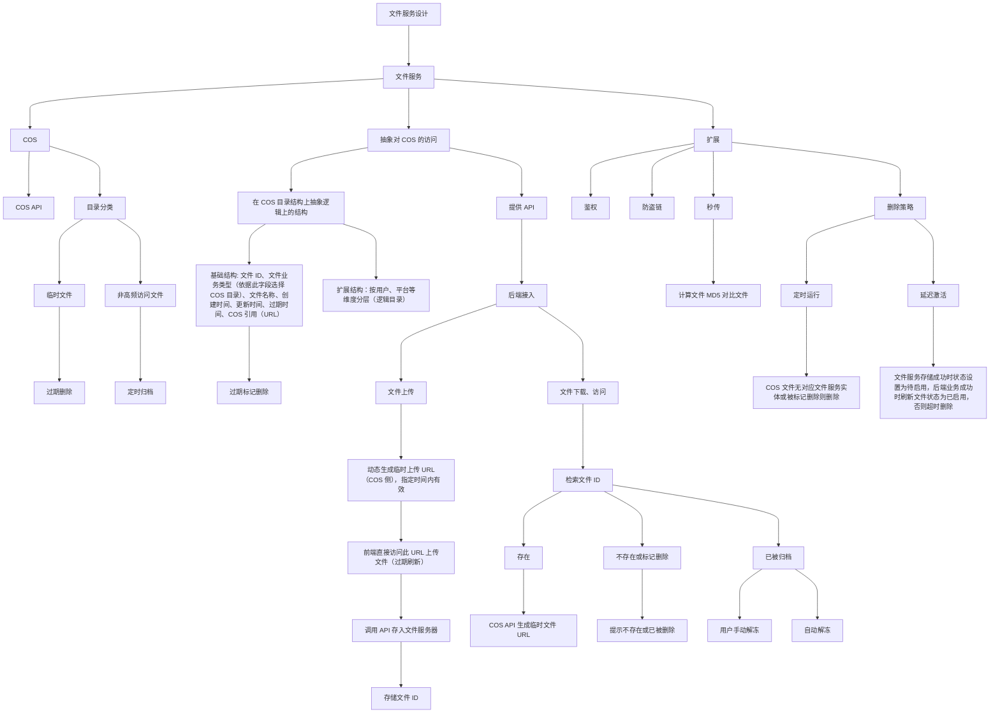

## 缓存设计

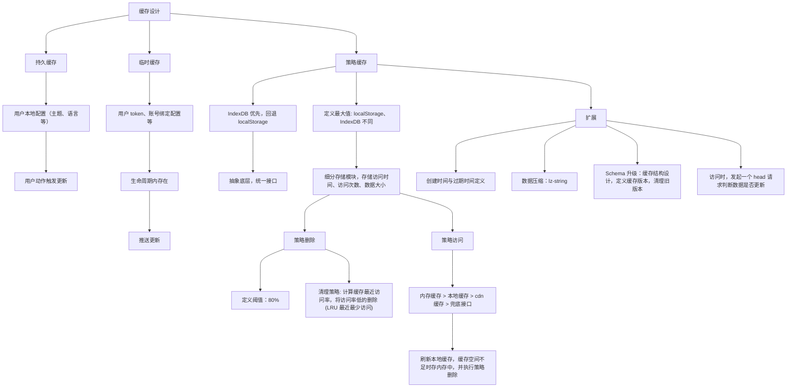

## 登录鉴权设计

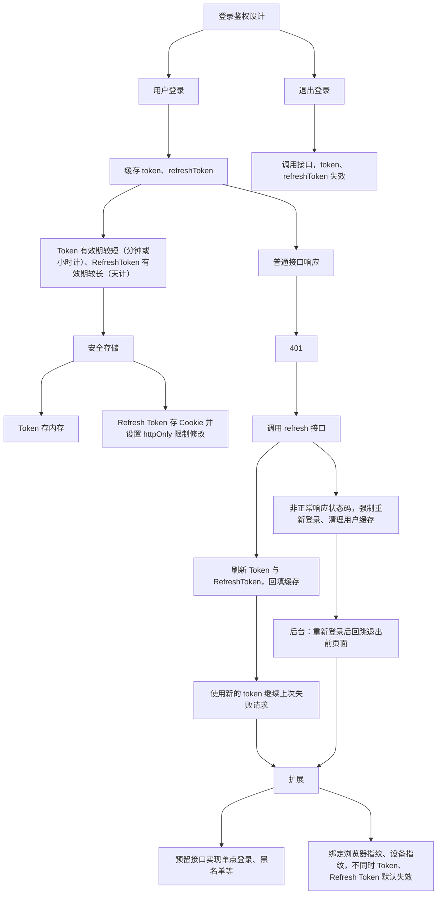

## 消息通知设计

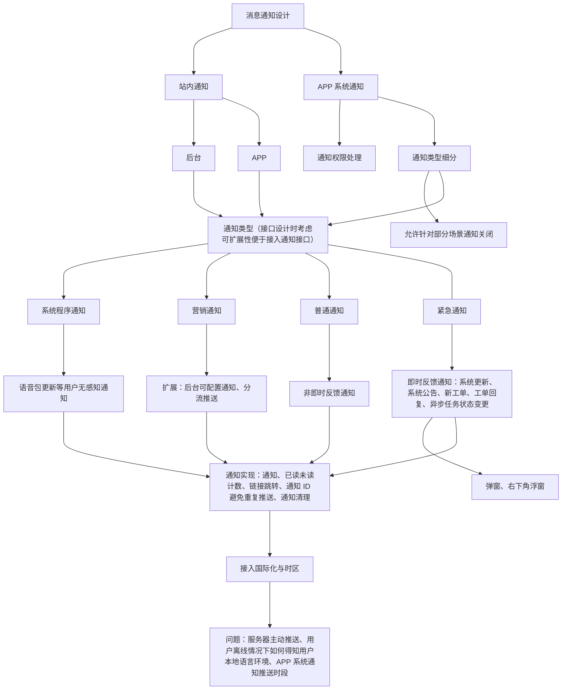

---

你的消息通知设计框架已覆盖基础功能分类和实现逻辑，但在用户体验、技术适配和商业化平衡上存在明显优化空间。对比喜马拉雅的亿级推送架构与微信订阅消息的合规实践，当前方案缺乏分级推送机制、离线送达保障和精细化用户控制能力，这可能导致高优先级消息被淹没或用户因骚扰关闭通知权限。

### 核心优化方向

#### 1. **分级推送系统：从"一刀切"到优先级调度**

现有设计将通知简单分为 "紧急/普通/营销"，但未解决资源竞争问题。喜马拉雅通过 **Kafka多Topic优先级队列** 实现消息插队机制，高优先级消息（如工单回复）可通过权重分配获得更多处理资源，避免被低优先级营销消息阻塞。建议：

- **建立四级优先级体系**：系统级（如账号安全）、业务关键（如新工单）、交互反馈（如评论回复）、营销内容（如活动推广），对应不同推送通道和展示方式

- **动态流量控制**：参考"用户日接收阈值+消息级别"双重过滤，当用户单日接收超过 10 条通知后，仅保留前两级消息

- **场景化展示策略**：紧急通知采用全屏弹窗（需用户确认），普通通知使用悬浮窗（3 秒自动消失），营销内容仅在通知中心展示

#### 2. **离线推送架构：跨平台送达保障**

当前方案未解决 "用户离线时如何推送" 的关键问题。Android 系统对自启限制趋严，自建保活通道已失效，需接入厂商级推送服务：

- **国内场景**：集成小米 MIUI 推送、华为 HMS、OPPO Push 等厂商通道，用户离线时通过系统级进程唤醒应用

- **海外场景**：对接谷歌 FCM 服务，需注意设备需安装 GMS 框架且连接海外网络的限制

- **设备状态同步**：APP 启动时上报 uid/deviceId 与推送 token 的绑定关系，通过 Kafka 实时更新设备状态，确保卸载重装后 token 自动刷新

#### 3. **国际化与本地化：突破语言与时区限制**

针对 "离线用户语言环境获取" 的问题，可采用三级解决方案：

- **预存储语言偏好**：用户在线时记录其语言设置（如 zh-CN/en-US）和时区信息，存储于用户画像数据库

- **端侧翻译缓存**：关键通知模板（如系统公告）预编译多语言版本，推送时附带语言标签，客户端根据本地设置展示对应版本

- **离线翻译服务**：部署 LibreTranslate 本地化服务，当用户语言设置变更时，通过 API 动态翻译历史通知内容，支持 15 种以上语言互译

#### 4. **用户控制体系：从被动接收转向主动管理**

参考微信订阅消息的教训（从模板消息强制切换导致开发者强烈反弹），需平衡业务触达与用户体验：

- **精细化开关设计**：提供"全类型-分类-单业务"三级控制，用户可关闭营销类但保留工单通知，或设置 "工作日 9:00-18:00 免打扰"

- **智能静默机制**：分析用户活跃时段（如夜间 11 点至凌晨 7 点），自动延迟非紧急通知至活跃时段推送

- **订阅式营销**：借鉴微信 "一次性订阅" 模式，营销通知需用户主动点击订阅卡片后才能发送，且每 30 天需重新授权

### 技术实现关键点

- **推送队列优化**：用 Kafka 替代 RabbitMQ，通过 topic 优先级（如 priority-high/priority-low）和权重拉取（高优先级每次拉取 2 倍消息量）实现动态调度

- **频控存储方案**：采用 ehash 结构（支持 field 级过期的 Redis 扩展），存储 deviceId, msgType, 发送计数 三元组，解决 6 亿设备 ×60+ 业务场景的存储压力

- **链路追踪**：全流程记录消息状态（创建/过滤/发送/送达/点击），通过 Grafana 展示推送到达率、平均延迟等核心指标

### 对比行业方案的劣势分析

| **维度**         | **当前设计**       | **行业最佳实践**                                         |
| ---------------- | ------------------ | -------------------------------------------------------- |
| **送达率保障**   | 依赖 APP 在线状态  | 厂商通道+自建长连接双保险（喜马拉雅达 98.7%）            |
| **用户干扰控制** | 仅支持部分场景关闭 | 动态频控+静默时间+分级展示（微信订阅消息投诉率下降 62%） |
| **国际化支持**   | 未解决离线语言适配 | 预编译模板+端侧翻译缓存（ntfy 支持 20 种语言）           |

### 落地路径建议

1. **第一阶段（1-2 个月）**：完成优先级队列改造和基础厂商通道集成，重点保障紧急通知送达率
2. **第二阶段（3-4 个月）**：上线用户控制中心和频控系统，支持按业务类型开关通知
3. **第三阶段（5-6 个月）**：接入离线翻译服务和动态场景推送，实现全球化适配

需特别注意，Android 各厂商推送 API 差异显著（如华为要求应用签名与开发者账号绑定），建议采用如极光推送等聚合 SDK 降低对接成本。最终目标是建立 "用户无感知高可用，开发者可配置，运营可追溯" 的闭环系统，在保障业务触达的同时将通知点击率提升 30% 以上。

## 异步任务设计

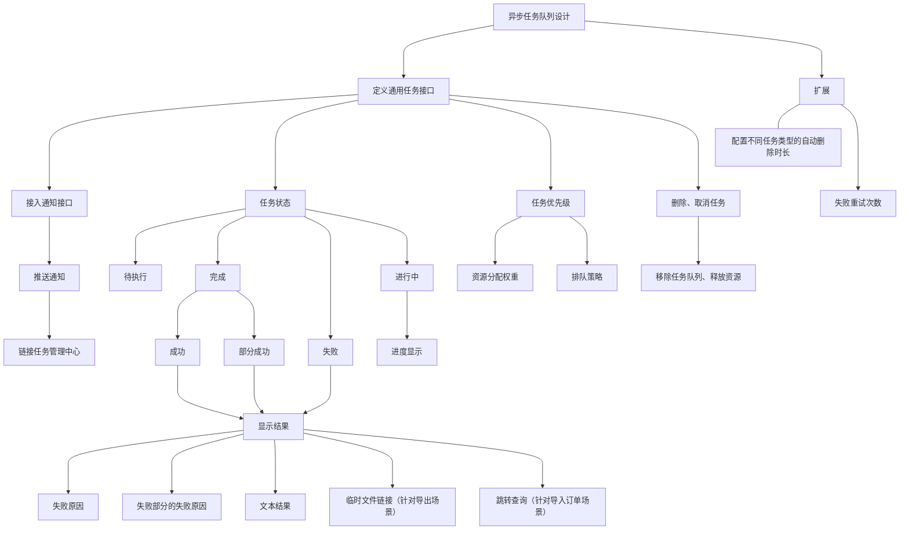

## 自动更新设计

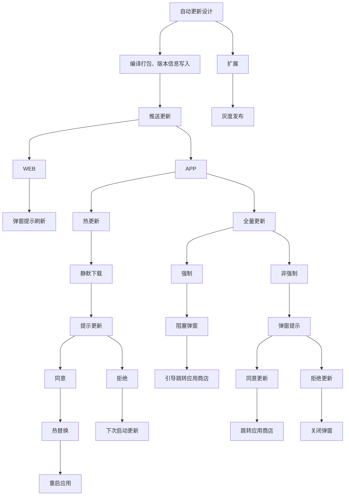

## 自动化部署设计

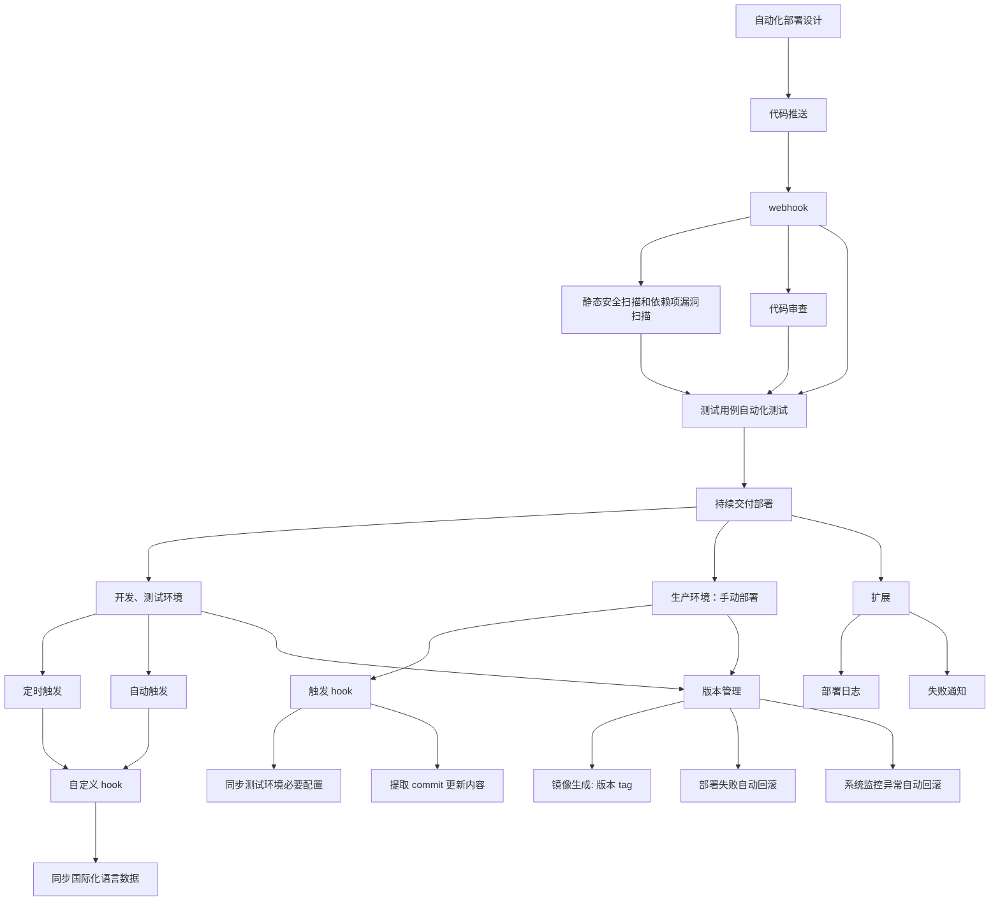

## 组件设计

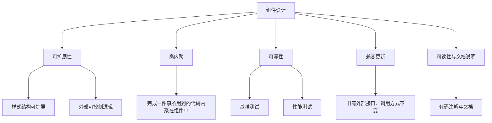

---

您的组件设计涵盖了软件工程的核心原则，但在现代前端或全栈组件化开发中，还可以从 **生命周期管理、状态驱动、容错性、以及国际化/文化适配** 四个维度进一步深化。

以下是针对您 Mermaid 架构的优化建议和改进点：

1. 架构逻辑优化：从 “设计原则” 到 “实现机制”

您原有的设计偏重于 “目标”，建议增加 **“机制层”**，使组件不仅 “可靠”，而且 “可预测”。

优化建议：

- **状态驱动 (State-Driven)**：组件的 UI 应该是状态的函数，减少直接的 DOM 操作或逻辑耦合。
- **防御式设计 (Robustness)**：除了测试，组件应具备自愈能力（如 Error Boundary）。
- **解耦策略**：将“业务逻辑”与“渲染组件”分离（容器组件与展示组件模式）。

------

2. 改进后的 Mermaid 架构图

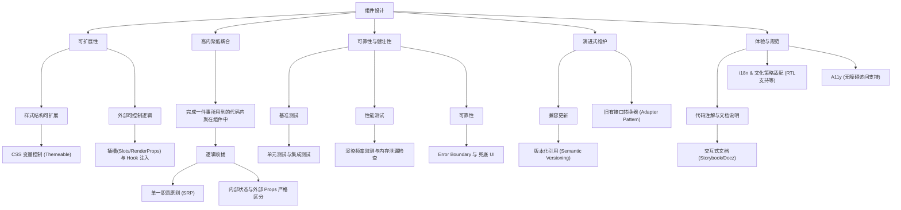

------

3. 核心改进点详细说明

A. 引入 “适配器模式” 解决兼容更新 (Compatibility)

您提到的 “旧有接口不变” 是核心需求。在代码层面，可以引入 **Adapter（适配器）**：

- **做法**：当组件内部逻辑重构时，不要直接修改原有的 Props 定义。保留旧 Props 入口，并在组件内部将其映射（Mapping）到新逻辑上。
- **提示**：在开发环境下，对使用旧接口的开发者抛出 `console.warn` 提示弃用进度，而非直接报错。

B. 逻辑扩展：从 “外部控制” 到 “控制反转 (IoC)”

- **优化方案**：除了简单的逻辑控制，提供 “钩子 (Hooks)” 或 “事件回调”。
- **场景**：如果这是一个文件上传组件，不要只给一个 `uploadURL` 属性，应该暴露 `onBeforeUpload`, `onProgress`, `onError` 等生命周期钩子，让外部业务能精细化介入。

C. 高内聚的延伸：职责单一 (SRP)

- **改进**：确保一个组件只解决一个层面的问题。例如，一个 “带区域分流逻辑的图片组件”，应该拆分为：
  1. **数据层组件**：负责根据区域分流配置获取正确的图片 URL。
  2. **渲染层组件**：纯粹负责显示图片、Loading 态和错误态。

D. 增加 “无障碍性 (Accessibility)” 与 “国际化感知”

作为一个优秀的组件设计，应考虑：

- **语义化**：使用正确的 HTML 标签（或 ARIA 属性），确保盲人阅读器可访问。
- **方向性**：针对中东等地区，组件需支持 **RTL (Right-to-Left)** 布局自适应。

E. 性能测试的具体落地

- **基准测试**：不仅是跑通测试用例，还需关注 **Re-render（重复渲染）** 次数。
- **工具推荐**：集成 React Testing Library 或 Vue Test Utils，并结合 Lighthouse 进行性能评估。

总结

您原来的设计已经非常扎实，改进后的版本强化了 **防御式编程（容错）**、版本演进（适配器）以及全球化适配（A11y/i18n）。这种设计能让您的组件在复杂的生产环境（特别是涉及 2025 年多端、多区域的大型项目）中更具生命力。

## APP 轨迹、异常上报设计

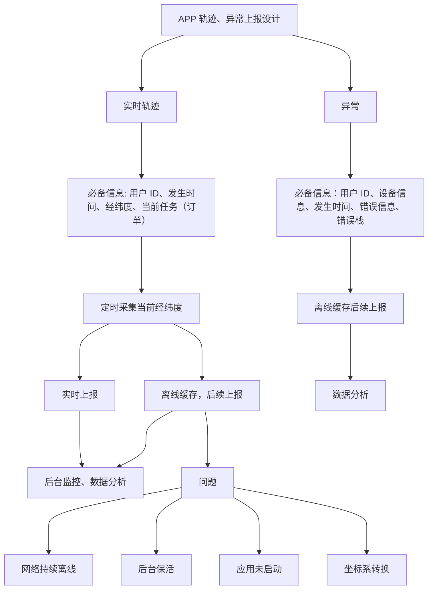

---

在 2025 年的开发环境下，要实现 “抓取轨迹、绘制地图、路径决策、实时定位、通行时长” 并兼顾 “离线可用”，最成熟的方案是采用 **Google Maps Platform** 的移动端 SDK。

以下是实现这一功能的架构设计与技术选型：

1. 核心技术栈

- **实时定位与轨迹抓取：** 使用 **Google Maps SDK (Android/iOS)** 的定位蓝点功能，配合手机原生 GPS 传感器。

- **地图渲染与轨迹绘制：** 通过 `Polyline` 对象将实时获取的经纬度点连接成线。

- **路径决策与通行时长：** 使用 **[Routes API (2025 新版)](https://developers.google.com/maps/documentation/routes)**。它比旧版更轻量，且能返回详细的实时路况（Traffic-aware）和预计到达时间 (ETA)。
- **离线功能：** 依靠 **Google Maps SDK Offline Maps** 或地图瓦片缓存。

------

2. 功能实现细节

A. 实时定位与轨迹抓取

程序通过 `FusedLocationProviderClient` 每隔几秒获取一次经纬度。

- **实时性：** 结合 `LocationRequest` 的高精度模式（Priority High Accuracy）。

- **轨迹记录：** 将获取的点存储在本地数据库（如 SQLite/Room），以防网络中断导致数据丢失。

B. 路线决策与通行时长 (Routes API)

在 2025 年，建议调用 **Routes API** 的 `computeRoutes` 方法：

- **决策因子：** 可设置 `routingPreference` 为 `TRAFFIC_AWARE_OPTIMAL`（实时路况最优），以获取避开拥堵的实时路线。

- **时长预估：** API 会返回 `duration` 和 `staticDuration`（无交通拥堵时长），对比两者即可得出延误时间。

C. 离线可用性的处理（关键点）

Google Maps 的官方 SDK 对纯离线开发有一定限制，通常采取以下策略：

1. **预下载地图：** 调用 `OfflineTileProvider` 或引导用户在 Google 地图 App 中预下载区域地图，SDK 会自动调用本地缓存。

2. **离线定位：** GPS 传感器不依赖网络，程序仍能抓取经纬度。

3. **离线路由：** 这是一个难点。如果必须在断网时 “重新决策路径”，建议集成开源的 **GraphHopper** 或 **OSRM** 作为离线路由引擎。

D. 实时经纬度上传

- **异步上传：** 使用 `WorkManager`（Android）在后台运行上传任务。
- **断网重传机制：** 当网络恢复时，程序应自动从本地数据库读取未上传的轨迹片段，批量补传到你的服务器后端。

------

3. 开发建议与合规性

4. **API 成本：** Routes API 按调用次数计费。建议在车辆静止时降低轨迹抓取频率，在路线未偏离时减少重算路径的频率。

5. **隐私权限：** 2025 年 iOS 和 Android 对后台位置权限要求极严。你必须在 `AndroidManifest.xml` 中声明 `ACCESS_BACKGROUND_LOCATION`，并向用户明确说明收集轨迹的用途。

6. **数据纠偏：** 原始 GPS 坐标在城市高楼区会有偏移，建议在绘制和上传前通过 **Roads API** 将轨迹点纠偏到实际道路上。

7. 推荐文档链接

- **Android Maps SDK 快速入门**
- **Routes API 迁移与功能指南**
- **WorkManager 处理后台上传任务**

## PDF 生成设计

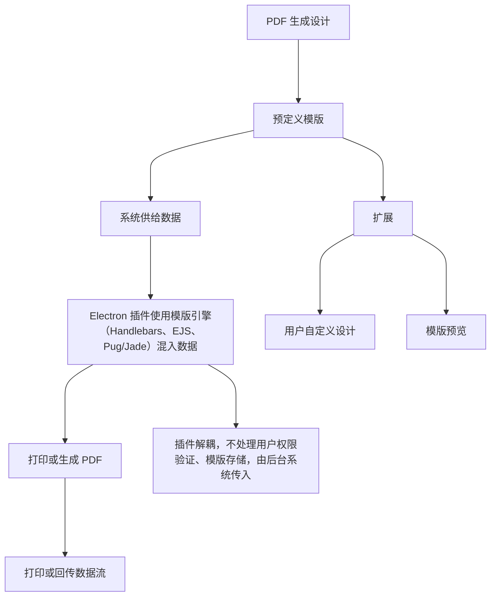

--end
